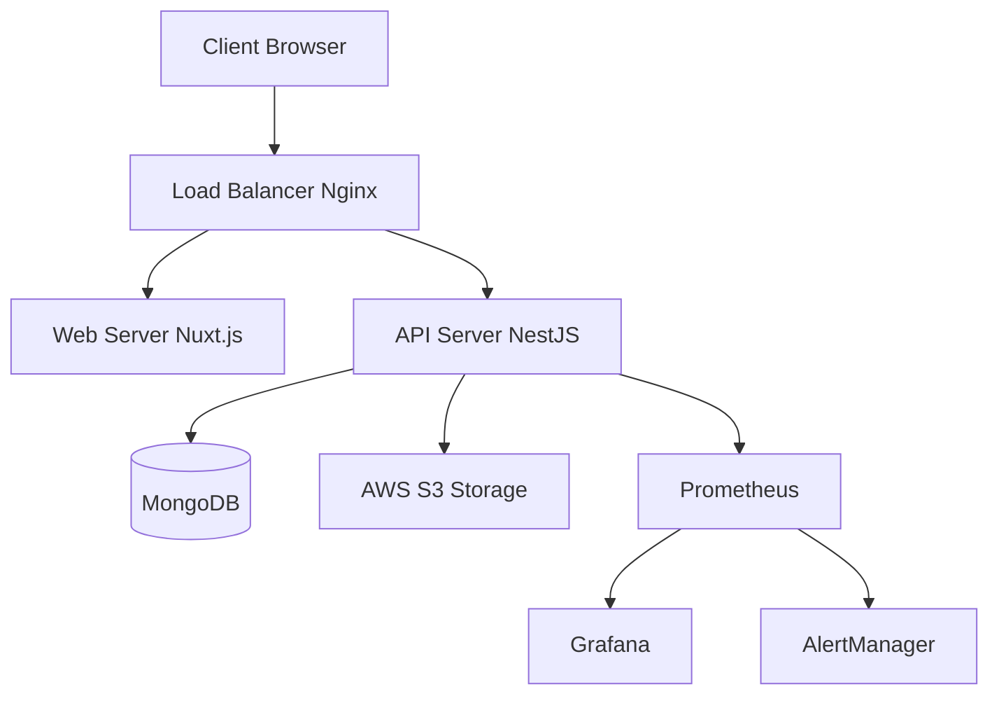

# Manuel de Déploiement - Benevoclic

## Vue d'ensemble

Ce manuel détaille les procédures de déploiement pour l'application Benevoclic, couvrant tous les environnements (développement, staging, production) et les différents types de déploiement (standard, hotfix, rollback).

## 1. Architecture de Déploiement

### 1.1 Environnements

#### Environnements Disponibles
```yaml
environments:
  development:
    url: "http://localhost:3000"
    purpose: "Développement local"
    database: "mongodb://localhost:27017/benevoclic-dev"
    
  staging:
    url: "https://staging.benevoclic.fr"
    purpose: "Tests et validation"
    database: "mongodb://staging-db:27017/benevoclic-staging"
    
  production:
    url: "https://benevoclic.fr"
    purpose: "Environnement de production"
    database: "mongodb://prod-db:27017/benevoclic-prod"
```

#### Infrastructure


**Explication :** L'architecture utilise Docker pour la conteneurisation, PM2 pour la gestion des processus, et un monitoring complet avec Prometheus/Grafana.

### 1.2 Technologies de Déploiement

#### Stack Technique
- **Containerisation** : Docker + Docker Compose
- **Gestion de processus** : PM2
- **Reverse Proxy** : Nginx
- **Base de données** : MongoDB 6.13.0
- **Stockage** : AWS S3
- **Monitoring** : Prometheus + Grafana + AlertManager
- **CI/CD** : GitHub Actions
- **Authentification** : Firebase Auth

## 2. Prérequis et Configuration

### 2.1 Prérequis Système

#### Serveur de Production
```bash
# Spécifications minimales
CPU: 4 cores
RAM: 8GB
Disk: 100GB SSD
OS: Ubuntu 22.04 LTS
Network: 100Mbps
```

#### Logiciels Requis
```bash
# Installation des prérequis
sudo apt update
sudo apt install -y \
  docker.io \
  docker-compose \
  nginx \
  nodejs \
  npm \
  pm2 \
  htop \
  git \
  curl \
  wget
```

#### Commandes de vérification
```bash
# Vérifier l'installation Docker
docker --version
docker-compose --version

# Vérifier Node.js et PM2
node --version
npm --version
pm2 --version

# Vérifier les services
systemctl status docker
systemctl status nginx
```

### 2.2 Configuration Docker

#### Commandes de déploiement principales
```bash
# Déployer l'API
cd benevoclic-api-nest
npm run deploy:api

# Déployer le web
cd benevoclic-web
npm run deploy:web

# Déployer le monitoring
npm run deploy:monitoring

# Déployer tout
npm run deploy:all
```

#### Commandes de maintenance
```bash
# Voir les logs
docker logs benevoclic-api --tail 100
pm2 logs benevoclic-api

# Redémarrer les services
docker-compose restart
pm2 restart benevoclic-api

# Mettre à jour les images
docker-compose pull
docker-compose up -d

# Vérifier le statut
docker ps
pm2 status
```

**Explication :** Ces commandes permettent de gérer le déploiement et la maintenance de l'application. PM2 gère les processus Node.js, tandis que Docker gère les conteneurs.

  # Visualisation Grafana
  grafana:
    image: grafana/grafana:latest
    container_name: benevoclic-grafana
    restart: unless-stopped
    ports:
      - "3001:3000"
    environment:
      - GF_SECURITY_ADMIN_PASSWORD=${GRAFANA_PASSWORD}
    volumes:
      - grafana_data:/var/lib/grafana

volumes:
  mongo_data:
  redis_data:
  prometheus_data:
  grafana_data:
```

### 2.3 Configuration Nginx

#### Configuration Reverse Proxy
```nginx
# nginx.conf
events {
    worker_connections 1024;
}

http {
    upstream api_backend {
        server api:3000;
    }

    upstream web_backend {
        server web:80;
    }

    # Rate limiting
    limit_req_zone $binary_remote_addr zone=api:10m rate=10r/s;
    limit_req_zone $binary_remote_addr zone=web:10m rate=30r/s;

    # Gzip compression
    gzip on;
    gzip_vary on;
    gzip_min_length 1024;
    gzip_types text/plain text/css text/xml text/javascript application/javascript application/xml+rss application/json;

    # Security headers
    add_header X-Frame-Options DENY;
    add_header X-Content-Type-Options nosniff;
    add_header X-XSS-Protection "1; mode=block";
    add_header Strict-Transport-Security "max-age=31536000; includeSubDomains" always;

    server {
        listen 80;
        server_name benevoclic.fr www.benevoclic.fr;
        return 301 https://$server_name$request_uri;
    }

    server {
        listen 443 ssl http2;
        server_name benevoclic.fr www.benevoclic.fr;

        # SSL Configuration
        ssl_certificate /etc/nginx/ssl/benevoclic.crt;
        ssl_certificate_key /etc/nginx/ssl/benevoclic.key;
        ssl_protocols TLSv1.2 TLSv1.3;
        ssl_ciphers ECDHE-RSA-AES256-GCM-SHA512:DHE-RSA-AES256-GCM-SHA512:ECDHE-RSA-AES256-GCM-SHA384:DHE-RSA-AES256-GCM-SHA384;
        ssl_prefer_server_ciphers off;

        # API Routes
        location /api/ {
            limit_req zone=api burst=20 nodelay;
            proxy_pass http://api_backend;
            proxy_set_header Host $host;
            proxy_set_header X-Real-IP $remote_addr;
            proxy_set_header X-Forwarded-For $proxy_add_x_forwarded_for;
            proxy_set_header X-Forwarded-Proto $scheme;
        }

        # Web Routes
        location / {
            limit_req zone=web burst=50 nodelay;
            proxy_pass http://web_backend;
            proxy_set_header Host $host;
            proxy_set_header X-Real-IP $remote_addr;
            proxy_set_header X-Forwarded-For $proxy_add_x_forwarded_for;
            proxy_set_header X-Forwarded-Proto $scheme;
        }

        # Health check
        location /health {
            access_log off;
            return 200 "healthy\n";
            add_header Content-Type text/plain;
        }
    }
}
```

## 3. Procédures de Déploiement

### 3.1 Déploiement Standard

#### Script de Déploiement Automatisé
```bash
#!/bin/bash
# deploy.sh

set -e

# Configuration
ENVIRONMENT=${1:-production}
VERSION=${2:-latest}
BACKUP_ENABLED=true

echo "🚀 Déploiement Benevoclic - Environnement: $ENVIRONMENT, Version: $VERSION"

# 1. Vérification des prérequis
echo "📋 Vérification des prérequis..."
check_prerequisites() {
    if ! command -v docker &> /dev/null; then
        echo "❌ Docker non installé"
        exit 1
    fi
    
    if ! command -v docker-compose &> /dev/null; then
        echo "❌ Docker Compose non installé"
        exit 1
    fi
    
    if [ ! -f ".env.$ENVIRONMENT" ]; then
        echo "❌ Fichier .env.$ENVIRONMENT manquant"
        exit 1
    fi
}

# 2. Sauvegarde (si activée)
backup_database() {
    if [ "$BACKUP_ENABLED" = true ]; then
        echo "💾 Sauvegarde de la base de données..."
        TIMESTAMP=$(date +%Y%m%d_%H%M%S)
        docker exec benevoclic-mongo mongodump --out /data/backup_$TIMESTAMP
        echo "✅ Sauvegarde créée: backup_$TIMESTAMP"
    fi
}

# 3. Pull des images
pull_images() {
    echo "📥 Téléchargement des images Docker..."
    docker-compose -f docker-compose.$ENVIRONMENT.yml pull
}

# 4. Arrêt des services
stop_services() {
    echo "🛑 Arrêt des services..."
    docker-compose -f docker-compose.$ENVIRONMENT.yml down
}

# 5. Déploiement
deploy_services() {
    echo "🚀 Déploiement des services..."
    docker-compose -f docker-compose.$ENVIRONMENT.yml up -d
}

# 6. Vérification de santé
health_check() {
    echo "🏥 Vérification de santé..."
    sleep 30
    
    # Vérification API
    if curl -f http://localhost:3000/health; then
        echo "✅ API en ligne"
    else
        echo "❌ API hors ligne"
        exit 1
    fi
    
    # Vérification Web
    if curl -f http://localhost/health; then
        echo "✅ Web en ligne"
    else
        echo "❌ Web hors ligne"
        exit 1
    fi
}

# 7. Tests de régression
run_regression_tests() {
    echo "🧪 Tests de régression..."
    if [ "$ENVIRONMENT" = "production" ]; then
        npm run test:regression
    fi
}

# 8. Notification
notify_deployment() {
    echo "📢 Notification de déploiement..."
    curl -X POST $DISCORD_WEBHOOK \
        -H "Content-Type: application/json" \
        -d "{\"content\": \"✅ Déploiement $VERSION terminé sur $ENVIRONMENT\"}"
}

# Exécution du déploiement
main() {
    check_prerequisites
    backup_database
    pull_images
    stop_services
    deploy_services
    health_check
    run_regression_tests
    notify_deployment
    
    echo "🎉 Déploiement terminé avec succès!"
}

main
```

### 3.2 Déploiement Hotfix

#### Script de Hotfix
```bash
#!/bin/bash
# hotfix.sh

set -e

ISSUE_ID=$1
VERSION=$2

echo "🚨 Déploiement Hotfix - Issue: $ISSUE_ID, Version: $VERSION"

# 1. Vérification de l'urgence
check_urgency() {
    echo "🔍 Vérification de l'urgence..."
    # Logique de vérification de l'urgence
}

# 2. Tests critiques uniquement
run_critical_tests() {
    echo "🧪 Tests critiques..."
    npm run test:critical
}

# 3. Déploiement rapide
quick_deploy() {
    echo "⚡ Déploiement rapide..."
    docker-compose -f docker-compose.prod.yml pull
    docker-compose -f docker-compose.prod.yml up -d --no-deps api
}

# 4. Vérification immédiate
immediate_health_check() {
    echo "🏥 Vérification immédiate..."
    sleep 10
    
    if curl -f http://localhost:3000/health; then
        echo "✅ Hotfix déployé avec succès"
    else
        echo "❌ Échec du hotfix, rollback automatique"
        rollback
    fi
}

# 5. Notification d'urgence
notify_hotfix() {
    curl -X POST $DISCORD_WEBHOOK \
        -H "Content-Type: application/json" \
        -d "{\"content\": \"🚨 Hotfix $VERSION déployé pour l'issue $ISSUE_ID\"}"
}

main() {
    check_urgency
    run_critical_tests
    quick_deploy
    immediate_health_check
    notify_hotfix
}

main
```

### 3.3 Procédure de Rollback

#### Script de Rollback
```bash
#!/bin/bash
# rollback.sh

set -e

PREVIOUS_VERSION=$1

echo "🔄 Rollback vers la version $PREVIOUS_VERSION"

# 1. Sauvegarde de l'état actuel
backup_current_state() {
    echo "💾 Sauvegarde de l'état actuel..."
    docker exec benevoclic-mongo mongodump --out /data/backup_before_rollback
}

# 2. Restauration de la version précédente
restore_previous_version() {
    echo "🔄 Restauration de la version précédente..."
    
    # Tag de la version précédente
    docker tag benevoclic/api:$PREVIOUS_VERSION benevoclic/api:latest
    docker tag benevoclic/web:$PREVIOUS_VERSION benevoclic/web:latest
    
    # Redémarrage des services
    docker-compose -f docker-compose.prod.yml down
    docker-compose -f docker-compose.prod.yml up -d
}

# 3. Vérification post-rollback
verify_rollback() {
    echo "✅ Vérification du rollback..."
    sleep 30
    
    if curl -f http://localhost:3000/health; then
        echo "✅ Rollback réussi"
    else
        echo "❌ Échec du rollback"
        exit 1
    fi
}

# 4. Notification
notify_rollback() {
    curl -X POST $DISCORD_WEBHOOK \
        -H "Content-Type: application/json" \
        -d "{\"content\": \"🔄 Rollback vers $PREVIOUS_VERSION effectué\"}"
}

main() {
    backup_current_state
    restore_previous_version
    verify_rollback
    notify_rollback
    
    echo "🎉 Rollback terminé avec succès!"
}

main
```

## 4. Configuration des Environnements

### 4.1 Variables d'Environnement

#### Production (.env.production)
```bash
# Application
NODE_ENV=production
PORT=3000

# Base de données
MONGODB_URI=mongodb://mongo:27017/benevoclic
MONGODB_USER=admin
MONGODB_PASSWORD=secure_password_123

# Redis
REDIS_URL=redis://redis:6379

# JWT
JWT_SECRET=your_super_secret_jwt_key_here
JWT_EXPIRES_IN=24h

# Firebase
FIREBASE_PROJECT_ID=benevoclic-prod
FIREBASE_PRIVATE_KEY=your_firebase_private_key
FIREBASE_CLIENT_EMAIL=your_firebase_client_email

# AWS S3
AWS_ACCESS_KEY_ID=your_aws_access_key
AWS_SECRET_ACCESS_KEY=your_aws_secret_key
AWS_REGION=eu-west-3
AWS_S3_BUCKET=benevoclic-prod

# Monitoring
PROMETHEUS_PORT=9090
GRAFANA_PASSWORD=secure_grafana_password

# Notifications
DISCORD_WEBHOOK=https://discord.com/api/webhooks/your_webhook
SMTP_HOST=smtp.gmail.com
SMTP_PORT=587
SMTP_USER=your_email@gmail.com
SMTP_PASS=your_email_password

# Sécurité
CORS_ORIGIN=https://benevoclic.fr
RATE_LIMIT_WINDOW=15m
RATE_LIMIT_MAX=100
```

#### Staging (.env.staging)
```bash
# Application
NODE_ENV=staging
PORT=3000

# Base de données
MONGODB_URI=mongodb://mongo:27017/benevoclic-staging
MONGODB_USER=admin
MONGODB_PASSWORD=staging_password_123

# Redis
REDIS_URL=redis://redis:6379

# JWT
JWT_SECRET=staging_jwt_secret_key
JWT_EXPIRES_IN=24h

# Firebase
FIREBASE_PROJECT_ID=benevoclic-staging
FIREBASE_PRIVATE_KEY=your_staging_firebase_private_key
FIREBASE_CLIENT_EMAIL=your_staging_firebase_client_email

# AWS S3
AWS_ACCESS_KEY_ID=your_staging_aws_access_key
AWS_SECRET_ACCESS_KEY=your_staging_aws_secret_key
AWS_REGION=eu-west-3
AWS_S3_BUCKET=benevoclic-staging

# Monitoring
PROMETHEUS_PORT=9090
GRAFANA_PASSWORD=staging_grafana_password

# Notifications
DISCORD_WEBHOOK=https://discord.com/api/webhooks/your_staging_webhook
SMTP_HOST=smtp.gmail.com
SMTP_PORT=587
SMTP_USER=your_staging_email@gmail.com
SMTP_PASS=your_staging_email_password

# Sécurité
CORS_ORIGIN=https://staging.benevoclic.fr
RATE_LIMIT_WINDOW=15m
RATE_LIMIT_MAX=100
```

### 4.2 Configuration SSL/TLS

#### Génération des Certificats
```bash
#!/bin/bash
# setup-ssl.sh

# 1. Installation de Certbot
sudo apt install -y certbot python3-certbot-nginx

# 2. Génération du certificat
sudo certbot --nginx -d benevoclic.fr -d www.benevoclic.fr

# 3. Configuration du renouvellement automatique
sudo crontab -e
# Ajouter: 0 12 * * * /usr/bin/certbot renew --quiet
```

## 5. Monitoring et Surveillance

### 5.1 Configuration Prometheus

#### prometheus.yml
```yaml
global:
  scrape_interval: 15s
  evaluation_interval: 15s

rule_files:
  - "alert_rules.yml"

alerting:
  alertmanagers:
    - static_configs:
        - targets:
          - alertmanager:9093

scrape_configs:
  - job_name: 'benevoclic-api'
    static_configs:
      - targets: ['api:3000']
    metrics_path: '/metrics'
    scrape_interval: 10s

  - job_name: 'benevoclic-web'
    static_configs:
      - targets: ['web:80']
    metrics_path: '/metrics'
    scrape_interval: 10s

  - job_name: 'mongodb'
    static_configs:
      - targets: ['mongo:27017']
    scrape_interval: 30s

  - job_name: 'redis'
    static_configs:
      - targets: ['redis:6379']
    scrape_interval: 30s
```

### 5.2 Règles d'Alerte

#### alert_rules.yml
```yaml
groups:
  - name: benevoclic_alerts
    rules:
      - alert: HighErrorRate
        expr: rate(http_requests_total{status=~"5.."}[5m]) > 0.1
        for: 2m
        labels:
          severity: critical
        annotations:
          summary: "Taux d'erreur élevé sur l'API"
          description: "Le taux d'erreur 5xx dépasse 10%"

      - alert: SlowResponseTime
        expr: histogram_quantile(0.95, rate(http_request_duration_seconds_bucket[5m])) > 1
        for: 5m
        labels:
          severity: warning
        annotations:
          summary: "Temps de réponse lent"
          description: "95% des requêtes prennent plus d'1 seconde"

      - alert: HighMemoryUsage
        expr: (node_memory_MemTotal_bytes - node_memory_MemAvailable_bytes) / node_memory_MemTotal_bytes > 0.85
        for: 5m
        labels:
          severity: warning
        annotations:
          summary: "Utilisation mémoire élevée"
          description: "L'utilisation mémoire dépasse 85%"

      - alert: ServiceDown
        expr: up == 0
        for: 1m
        labels:
          severity: critical
        annotations:
          summary: "Service {{ $labels.job }} hors ligne"
          description: "Le service {{ $labels.job }} est inaccessible"
```

## 6. Sécurité

### 6.1 Configuration de Sécurité

#### Firewall
```bash
#!/bin/bash
# setup-firewall.sh

# Configuration UFW
sudo ufw default deny incoming
sudo ufw default allow outgoing

# Ports autorisés
sudo ufw allow ssh
sudo ufw allow 80/tcp
sudo ufw allow 443/tcp
sudo ufw allow 3000/tcp

# Activation du firewall
sudo ufw enable
```

#### Sécurité Docker
```bash
# Sécurisation des conteneurs
docker run --security-opt=no-new-privileges \
  --cap-drop=ALL \
  --read-only \
  -v /tmp:/tmp:rw \
  your-image
```

### 6.2 Sauvegarde et Récupération

#### Script de Sauvegarde
```bash
#!/bin/bash
# backup.sh

set -e

BACKUP_DIR="/backups"
TIMESTAMP=$(date +%Y%m%d_%H%M%S)

echo "💾 Sauvegarde de Benevoclic - $TIMESTAMP"

# 1. Sauvegarde MongoDB
echo "📊 Sauvegarde de la base de données..."
docker exec benevoclic-mongo mongodump \
  --out /data/backup_$TIMESTAMP \
  --gzip

# 2. Sauvegarde des fichiers
echo "📁 Sauvegarde des fichiers..."
tar -czf $BACKUP_DIR/files_$TIMESTAMP.tar.gz \
  /var/lib/docker/volumes/benevoclic_*

# 3. Sauvegarde des configurations
echo "⚙️ Sauvegarde des configurations..."
tar -czf $BACKUP_DIR/config_$TIMESTAMP.tar.gz \
  docker-compose.prod.yml \
  nginx.conf \
  .env.production

# 4. Nettoyage des anciennes sauvegardes (garde 7 jours)
find $BACKUP_DIR -name "*.tar.gz" -mtime +7 -delete

echo "✅ Sauvegarde terminée: backup_$TIMESTAMP"
```

## 7. Maintenance

### 7.1 Maintenance Préventive

#### Script de Maintenance
```bash
#!/bin/bash
# maintenance.sh

echo "🔧 Maintenance préventive Benevoclic"

# 1. Nettoyage des conteneurs
echo "🧹 Nettoyage des conteneurs..."
docker container prune -f
docker image prune -f
docker volume prune -f

# 2. Mise à jour des images
echo "📦 Mise à jour des images..."
docker-compose -f docker-compose.prod.yml pull

# 3. Vérification de l'espace disque
echo "💾 Vérification de l'espace disque..."
df -h

# 4. Vérification des logs
echo "📋 Vérification des logs..."
docker-compose -f docker-compose.prod.yml logs --tail=100

# 5. Test de connectivité
echo "🌐 Test de connectivité..."
curl -f http://localhost/health
curl -f http://localhost:3000/health

echo "✅ Maintenance terminée"
```

### 7.2 Surveillance Continue

#### Script de Surveillance
```bash
#!/bin/bash
# monitor.sh

# Vérification de santé toutes les 5 minutes
while true; do
    # Vérification API
    if ! curl -f http://localhost:3000/health > /dev/null 2>&1; then
        echo "❌ API hors ligne - $(date)"
        # Notification Discord
        curl -X POST $DISCORD_WEBHOOK \
            -H "Content-Type: application/json" \
            -d '{"content": "🚨 API Benevoclic hors ligne"}'
    fi
    
    # Vérification Web
    if ! curl -f http://localhost/health > /dev/null 2>&1; then
        echo "❌ Web hors ligne - $(date)"
        # Notification Discord
        curl -X POST $DISCORD_WEBHOOK \
            -H "Content-Type: application/json" \
            -d '{"content": "🚨 Web Benevoclic hors ligne"}'
    fi
    
    sleep 300
done
```

## 8. Troubleshooting

### 8.1 Problèmes Courants

#### Problème : Conteneur ne démarre pas
```bash
# Diagnostic
docker logs benevoclic-api
docker logs benevoclic-web

# Vérification des ressources
docker stats

# Redémarrage forcé
docker-compose -f docker-compose.prod.yml restart
```

#### Problème : Base de données inaccessible
```bash
# Vérification de la connexion
docker exec -it benevoclic-mongo mongosh

# Vérification des logs
docker logs benevoclic-mongo

# Redémarrage du service
docker-compose -f docker-compose.prod.yml restart mongo
```

#### Problème : Performance dégradée
```bash
# Vérification des ressources
htop
docker stats

# Vérification des logs d'erreur
docker-compose -f docker-compose.prod.yml logs api | grep ERROR

# Redémarrage des services
docker-compose -f docker-compose.prod.yml restart
```

### 8.2 Logs et Debugging

#### Configuration des Logs
```yaml
# docker-compose.prod.yml - Configuration des logs
services:
  api:
    logging:
      driver: "json-file"
      options:
        max-size: "10m"
        max-file: "3"
  
  web:
    logging:
      driver: "json-file"
      options:
        max-size: "10m"
        max-file: "3"
```

#### Commandes de Debugging
```bash
# Affichage des logs en temps réel
docker-compose -f docker-compose.prod.yml logs -f

# Affichage des logs d'un service spécifique
docker-compose -f docker-compose.prod.yml logs -f api

# Accès au shell d'un conteneur
docker exec -it benevoclic-api sh

# Vérification de l'état des conteneurs
docker-compose -f docker-compose.prod.yml ps
```

## Conclusion

Ce manuel de déploiement fournit toutes les procédures nécessaires pour déployer et maintenir l'application Benevoclic en production. Il couvre :

- **Déploiement automatisé** : Scripts de déploiement standard et hotfix
- **Configuration sécurisée** : SSL/TLS, firewall, variables d'environnement
- **Monitoring complet** : Prometheus, Grafana, alertes
- **Maintenance préventive** : Sauvegardes, nettoyage, surveillance
- **Troubleshooting** : Diagnostic et résolution des problèmes courants

Cette approche garantit un déploiement fiable, sécurisé et maintenable de l'application Benevoclic. 