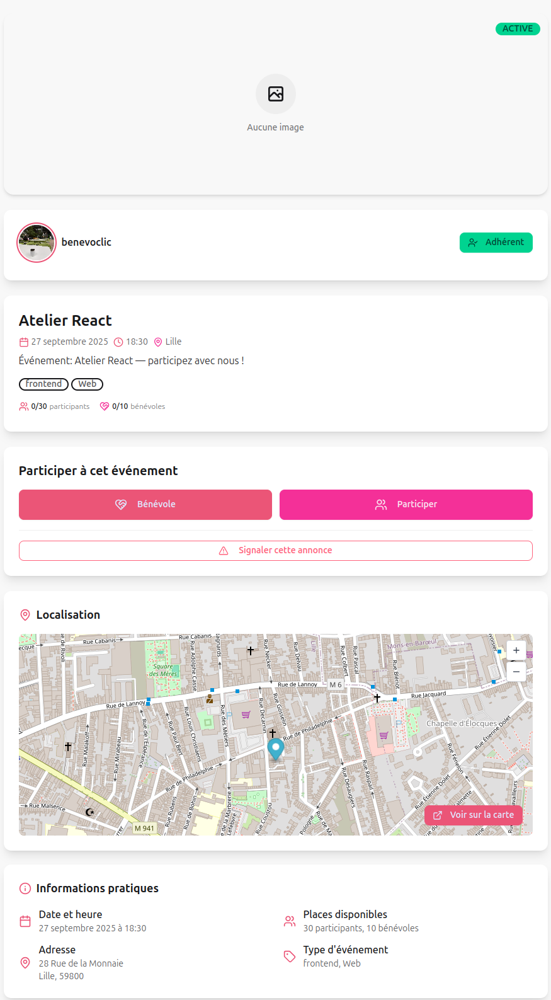
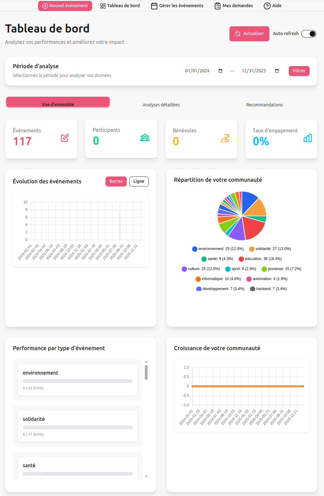
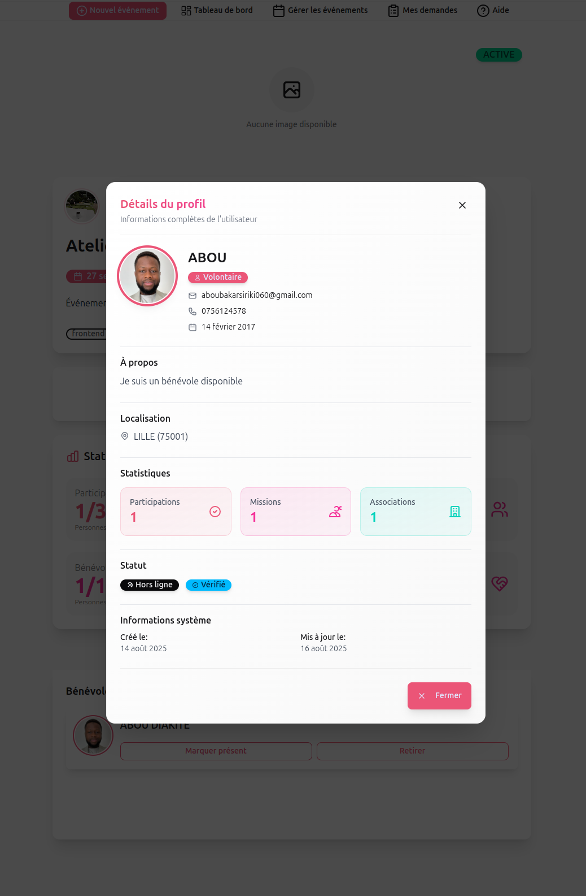
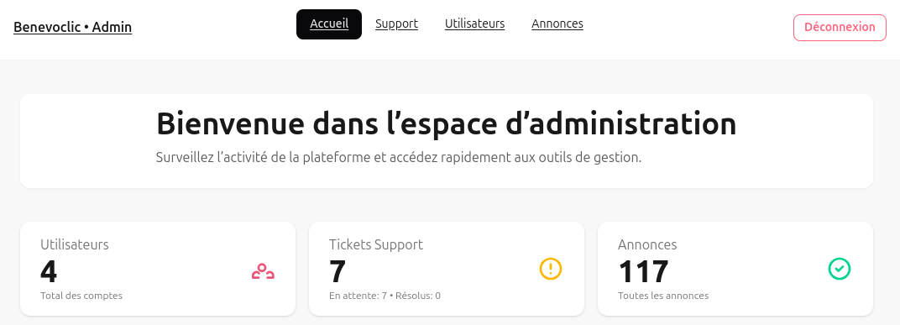
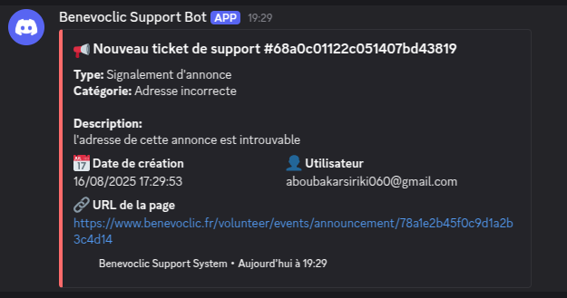

# Manuel d'Utilisation - Benevoclic

## Vue d'ensemble

Ce manuel d'utilisation présente l'application Benevoclic, une plateforme de mise en relation entre bénévoles et associations pour des missions de bénévolat. Il couvre toutes les fonctionnalités disponibles pour chaque type d'utilisateur.

## 1. Introduction à Benevoclic

### 1.1 Qu'est-ce que Benevoclic ?

Benevoclic est une plateforme web qui facilite la mise en relation entre :
- **Bénévoles** : Personnes souhaitant s'engager dans des missions de bénévolat
- **Associations** : Organisations proposant des missions de bénévolat
- **Administrateurs** : Gestionnaires de la plateforme

### 1.2 Fonctionnalités Principales

#### Pour les Bénévoles
- ✅ Recherche de missions par localisation et catégorie
- ✅ Inscription aux missions de bénévolat
- ✅ Gestion du profil personnel
- ✅ Suivi des missions participées

#### Pour les Associations
- ✅ Création et gestion de missions
- ✅ Gestion des bénévoles inscrits
- ✅ Tableaux de bord et statistiques
- ✅ Communication avec les bénévoles
- ✅ Validation des participations

#### Pour les Administrateurs
- ✅ Modération des contenus
- ✅ Gestion des utilisateurs
- ✅ Statistiques globales
- ✅ Support utilisateur
- ✅ Maintenance de la plateforme

## 2. Premiers Pas

### 2.1 Accès à l'Application

#### URL d'Accès
- **Production** : https://www.benevoclic.fr
- **Support** : support@benevoclic.fr

#### Navigateurs Supportés
- ✅ **Chrome** : Version 90+
- ✅ **Firefox** : Version 88+
- ✅ **Safari** : Version 14+
- ✅ **Edge** : Version 90+

### 2.2 Création d'un Compte

#### Inscription Bénévole
1. **Accès à la page d'inscription**
   - Cliquer sur "S'inscrire" dans le menu principal
   - Sélectionner "Bénévole"

2. **Remplir le formulaire**
   ```
   Informations personnelles :
   - Email : [votre.email@exemple.com]
   - Mot de passe : [Mot de passe sécurisé]
   - Confirmation : [Répéter le mot de passe]
   ```

3. **Validation du compte**
   - Vérifier l'email reçu
   - Cliquer sur le lien de validation
   - Compte activé automatiquement

#### Commandes pour tester l'inscription
```bash
# Démarrer l'application en développement
cd benevoclic-web
npm run start

# Accéder à l'application
# URL: http://localhost:5482

# Démarrer l'API backend
cd benevoclic-api-nest
npm run start:dev

# URL API: http://localhost:3000
```

**Explication :** Le processus d'inscription utilise Firebase Authentication pour la sécurité et la validation des emails. Les données sont stockées dans MongoDB via l'API NestJS.

#### Inscription Association
1. **Accès à la page d'inscription**
   - Cliquer sur "S'inscrire"
   - Sélectionner "Association"

2. **Remplir le formulaire**
   ```
   Informations de l'association :
   - SIRET : [Numéro SIRET]
   - Email : [contact@association.fr]
   - Mot de passe : [Mot de passe sécurisé]
   - Nom de l'association : [Nom officiel]

   
   Informations de contact :
   - Téléphone : [Numéro de contact]
   - Adresse : [Adresse de l'association]
   - Description : [Description de l'association]
   ```

3. **Validation par l'équipe**
   - Compte créé en attente de validation
   - Validation sous 48h par l'équipe Benevoclic
   - Email de confirmation envoyé

**Explication :** Les associations doivent être validées par l'équipe Benevoclic pour garantir la qualité et la légitimité des organisations utilisant la plateforme.

### 2.3 Connexion

#### Connexion Standard
1. **Accès à la page de connexion**
   - Cliquer sur "Se connecter"

2. **Saisie des identifiants**
   ```
   Email : [votre.email@exemple.com]
   Mot de passe : [votre mot de passe]
   ```

3. **Connexion sécurisée**
   - Validation des identifiants via Firebase Auth
   - Redirection vers le dashboard personnel
   - Session sécurisée avec JWT

#### Commandes pour tester la connexion
```bash
# Vérifier que l'API est accessible
curl http://localhost:3000/health

# Vérifier que l'application web fonctionne
curl http://localhost:5482

# Voir les logs de l'API
cd benevoclic-api-nest
npm run pm2:logs
```

**Explication :** La connexion utilise Firebase Authentication pour la sécurité. Les tokens JWT sont utilisés pour maintenir la session utilisateur.

#### Récupération de Mot de Passe
1. **Demande de réinitialisation**
   - Cliquer sur "Mot de passe oublié ?"
   - Saisir l'email du compte

2. **Réception de l'email**
   - Email avec lien de réinitialisation
   - Lien valide pendant 24h

3. **Nouveau mot de passe**
   - Cliquer sur le lien dans l'email
   - Saisir le nouveau mot de passe
   - Confirmation du changement

## 3. Guide Bénévole

#### Navigation Principale
- **🏠 Accueil** : Dashboard principal
- **🔍 Rechercher** : Trouver des missions
- **📅 Mes Missions** : Missions inscrites et passées
- **👤 Profil** : Gestion du profil personnel
- **⚙️ Paramètres** : Configuration du compte

### 3.2 Recherche de Missions

#### Recherche Simple
1. **Accès à la recherche**
   - Cliquer sur "Rechercher" dans le menu
   - Ou utiliser la barre de recherche principale

2. **Filtres de base**
   ```
   📍 Localisation : [Votre ville ou code postal]
   🏷️ Catégorie : [Toutes catégories]
   📅 Disponibilité : [Cette semaine]
   🕐 Durée : [Toutes durées]
   ```

3. **Résultats**
   - Liste des missions correspondantes
   - Tri par proximité par défaut
   - Informations essentielles affichées

#### Recherche Avancée

1. **Géolocalisation**
   - Utiliser "Ma position" pour géolocalisation
   - Définir un rayon de recherche (5-200km)
   - Carte interactive avec les missions

2. **Sauvegarde de recherche**
   - Sauvegarder les critères favoris
   - Historique des recherches

### 3.3 Inscription aux Missions

#### Consultation d'une Mission
1. **Détails de la mission**

   

2. **Informations pratiques**
   - Plan d'accès et transport
   - Contact de l'association
   - Équipement fourni
   - Conditions météo

#### Processus d'Inscription
1. **Vérification des disponibilités**
   - Contrôler la date et l'heure
   - Vérifier le nombre de places
   - Lire les prérequis

2. **Inscription**
   - Cliquer sur "S'inscrire"
   - Confirmer l'inscription
   - Recevoir une confirmation

3. **Suivi**
   - Mission ajoutée au calendrier
   - Email de confirmation
   - Rappel 24h avant

### 3.4 Gestion du Profil

#### Informations Personnelles
1. **Modification des données**
   ```
   Informations de base :
   - Nom et prénom
   - Email et téléphone
   - Adresse et localisation
   
   Informations complémentaires :
   - Date de naissance
   - Centres d'intérêt
   - Compétences particulières
   ```

2. **Photo de profil**
   - Upload d'une photo
   - Format : JPG, PNG
   - Taille max : 2MB
   - Redimensionnement automatique

#### Préférences
1. **Catégories préférées**
   - Sélectionner les domaines d'intérêt
   - Priorité dans les recommandations
   - Notifications personnalisées

2. **Disponibilités**
   - Jours de la semaine
   - Horaires préférés
   - Rayon de déplacement

3. **Notifications**
   - Email : Nouvelles missions
   - Push : Rappels et confirmations
   - SMS : Urgences uniquement

### 3.5 Suivi des Missions

#### Missions à Venir
1. **Vue calendrier**
   - Calendrier mensuel
   - Missions colorées par catégorie
   - Détails au survol

2. **Actions disponibles**
   - Voir les détails
   - Modifier l'inscription
   - Annuler la participation
   - Contacter l'association

#### Historique des Missions
1. **Missions passées**
   - Date et durée
   - Association organisatrice
   - Note donnée
   - Badge obtenu

2. **Statistiques**
   - Total des heures
   - Nombre de missions
   - Associations fréquentées
   - Évolution dans le temps

## 4. Guide Association

### 4.1 Dashboard Association

#### Vue d'Ensemble



#### Navigation Principale
- **🏠 Accueil** : Dashboard principal
- **➕ Créer Mission** : Nouvelle mission
- **📅 Mes Missions** : Gestion des missions
- **👥 Bénévoles** : Gestion des participants
- **📊 Statistiques** : Analyses détaillées
- **⚙️ Paramètres** : Configuration association

### 4.2 Création de Missions

#### Formulaire de Création
1. **Informations de base**
   ```
   📝 Titre de la mission : [Titre accrocheur]
   📄 Description : [Description détaillée]
   🏷️ Catégorie : [Sélectionner une catégorie]
   
   📅 Date et heure :
   - Date : [Sélectionner la date]
   - Heure de début : [14:00]
   - Heure de fin : [18:00]
   - Durée : [4 heures]
   ```

2. **Localisation**
   ```
   📍 Adresse :
   - Adresse complète : [123 Rue de la Paix]
   - Code postal : [75001]
   - Ville : [Paris]
   - Pays : [France]
   
   🗺️ Carte : [Sélectionner sur la carte]
   ```

3. **Détails pratiques**
   ```
   👥 Nombre de bénévoles :
   - Minimum : [2]
   - Maximum : [10]
   
   🎯 Prérequis : [Aucun prérequis particulier]
   🎒 Équipement fourni : [Gants, masques]
   🍽️ Repas fourni : [Oui/Non]
   ```

#### Publication et Gestion
1. **Statuts de mission**
   - **Publiée** : Visible par les bénévoles
   - **Annulée** : Mission annulée
   - **Terminée** : Mission réalisée
   - **En cours** : Mission en cours

2. **Modification**
   - Modifier les détails
   - Annuler la mission
   - Dupliquer pour une nouvelle mission

### 4.3 Gestion des Bénévoles

#### Liste des Inscrits
1. **Vue des Bénévoles**
   

2. **Actions disponibles**
   - Voir le profil complet
   - Valider la participation du bénévole
   - Le mettre present
   - Exclure le bénévole de la mission


### 4.3 Statistiques et Analytics

#### Métriques Principales
1. **Engagement**
   - Nombre de missions créées
   - Taux de remplissage
   - Taux de participation
   - Satisfaction moyenne

2. **Bénévoles**
   - Nombre de bénévoles actifs
   - Nouveaux bénévoles
   - Fidélisation
   - Répartition géographique

3. **Impact**
   - Heures de bénévolat
   - Missions réalisées
   - Bénéficiaires touchés
   - Évolution dans le temps

#### Rapports
1. **Rapports automatiques**
   - Rapport mensuel
   - Rapport trimestriel
   - Rapport annuel


## 5. Guide Administrateur

### 5.1 Dashboard Administrateur

#### Vue d'Ensemble
   

#### Navigation Principale
- **🏠 Accueil** : Dashboard principal
- **👥 Utilisateurs** : Gestion des comptes
- **📋 Modération** : Validation et signalements
- **📊 Analytics** : Statistiques détaillées
- **📧 Support** : Messages utilisateurs
- **⚙️ Configuration** : Paramètres système

### 5.2 Gestion des Utilisateurs

#### Validation des Associations
1. **Demandes en attente**
   ```
   🏢 Croix-Rouge Paris
   📧 contact@croixrouge-paris.fr
   📅 Demande du 15/08/2024
   📋 Documents : ✅ Logo, ✅ Statuts
   [Valider] [Refuser] [Demander plus d'infos]
   ```

2. **Actions de validation**
   - Vérifier les documents
   - Contacter l'association
   - Valider ou refuser

#### Modération des Comptes
1. **Signalements**
   - Comportement inapproprié
   - Contenu inapproprié
   - Spam ou publicité
   - Fausses informations

2. **Actions de modération**
   - Avertissement
   - Suspension temporaire
   - Bannissement définitif
   - Suppression du compte

### 5.3 Support Utilisateur

#### Centre de Support
1. **Messages reçus**

   

2. **Catégories de support**
   - **Technique** : Problèmes d'utilisation
   - **Compte** : Gestion du compte
   - **Mission** : Problèmes de missions
   - **Signalement** : Comportements inappropriés

#### Base de Connaissances
1. **Articles d'aide**
   - FAQ générale
   - Guides d'utilisation
   - Tutoriels vidéo
   - Résolution de problèmes

2. **Mise à jour**
   - Créer de nouveaux articles
   - Modifier les existants
   - Organiser par catégories
   - Statistiques de consultation

#### Filtres Avancés
1. **Filtres de localisation**
   - Rayon de recherche (1-100km)
   - Ville ou code postal spécifique

2. **Filtres de mission**
   - Catégorie spécifique
   - Durée (1h à 8h+)
   - Date (aujourd'hui à 3 mois)
   - Nombre de places disponibles

3. **Filtres d'association**
   - Association spécifique
   - Note minimale
   - Nombre de missions organisées
   - Type d'association

#### Recherche Intelligente
1. **Recommandations**
   - Basées sur l'historique
   - Missions similaires
   - Associations fréquentées
   - Horaires préférés

2. **Recherche sémantique**
   - Mots-clés dans la description
   - Compétences requises
   - Type d'activité
   - Public cible

## 7. Sécurité et Confidentialité

### 7.1 Protection des Données

#### Données Collectées
1. **Données personnelles**
   - Nom et prénom
   - Email et téléphone
   - Adresse postale
   - Date de naissance

2. **Données d'utilisation**
   - Historique des missions
   - Préférences de recherche
   - Interactions avec les associations
   - Statistiques de participation

#### Utilisation des Données
1. **Finalités**
   - Mise en relation bénévoles/associations
   - Amélioration du service
   - Support utilisateur
   - Statistiques anonymisées

2. **Conservation**
   - Données actives : durée du compte
   - Données archivées : 3 ans
   - Suppression définitive : 5 ans

### 7.2 Sécurité du Compte

#### Protection du Mot de Passe
1. **Exigences**
   - Minimum 8 caractères
   - Au moins une majuscule
   - Au moins un chiffre
   - Au moins un caractère spécial

2. **Sécurité renforcée**
   - Authentification à deux facteurs
   - Connexions suspectes détectées
   - Verrouillage automatique
   - Historique des connexions

#### Confidentialité
1. **Paramètres de confidentialité**
   ```
   👤 Profil public :
   - Nom et prénom : ✅
   - Photo : ✅
   - Ville : ✅
   - Email : ✅
   - Téléphone : ✅
   
   📊 Statistiques :
   - Missions participées : ✅
   - Heures de bénévolat : ✅
   ```

2. **Contrôle des données**
   - Export des données personnelles
   - Suppression du compte
   - Droit à l'oubli
   - Portabilité des données

## 8. Support et Aide

### 8.1 Centre d'Aide

#### FAQ Générale
1. **Questions fréquentes**
   - Comment créer un compte ?
   - Comment s'inscrire à une mission ?
   - Comment annuler une inscription ?
   - Comment contacter une association ?

2. **Guides détaillés**
   - Guide du bénévole
   - Guide de l'association
   - Guide de l'administrateur
   - Tutoriels vidéo

#### Contact Support
1. **Canaux de contact**
   - 📧 Email : support@benevoclic.fr
   - 💬 Chat : Support en ligne
   - 📞 Téléphone : +33 1 23 45 67 89
   - 📱 Application : Formulaire intégré

2. **Informations à fournir**
   - Type de compte (bénévole/association)
   - Description du problème
   - Captures d'écran si nécessaire
   - Navigateur et système d'exploitation

### 8.2 Communauté

#### Forum Communautaire
1. **Échanges entre utilisateurs**
   - Conseils et astuces
   - Retours d'expérience
   - Suggestions d'amélioration
   - Questions générales

2. **Modération**
   - Respect des règles
   - Modération des contenus
   - Signalement d'abus
   - Support communautaire

#### Réseaux Sociaux
1. **Présence en ligne**
   - Facebook : Benevoclic
   - Twitter : @Benevoclic
   - LinkedIn : Benevoclic
   - Instagram : benevoclic_officiel

2. **Contenu partagé**
   - Témoignages de bénévoles
   - Missions en cours
   - Actualités de l'association
   - Conseils et bonnes pratiques

## 9. Évolutions et Mises à Jour

### 9.1 Nouvelles Fonctionnalités

#### Fonctionnalités Récentes
1. **Application mobile**
   - Version iOS et Android
   - Notifications push
   - Géolocalisation
   - Mode hors ligne

2. **Chat intégré**
   - Messagerie instantanée
   - Partage de photos
   - Notifications en temps réel
   - Historique des conversations

#### Fonctionnalités à Venir
1. **Intelligence artificielle**
   - Recommandations personnalisées
   - Matching automatique
   - Analyse des préférences
   - Optimisation des missions

2. **Gamification avancée**
   - Défis mensuels
   - Classements
   - Récompenses spéciales
   - Événements communautaires

### 9.2 Amélioration Continue

#### Retours Utilisateurs
1. **Système de feedback**
   - Évaluation des missions
   - Suggestion d'amélioration
   - Signalement de bugs
   - Enquêtes de satisfaction

2. **Tests utilisateurs**
   - Tests de nouvelles fonctionnalités
   - Groupes de discussion
   - Interviews utilisateurs
   - Analyse des comportements

#### Roadmap
1. **Court terme (3 mois)**
   - Amélioration de la recherche
   - Optimisation mobile
   - Nouveaux badges
   - Intégration calendrier

2. **Moyen terme (6 mois)**
   - Application mobile native
   - Système de recommandations
   - Chat vidéo
   - Intégration réseaux sociaux

3. **Long terme (1 an)**
   - Intelligence artificielle
   - Réalité augmentée
   - Blockchain pour la certification
   - Expansion internationale

## Conclusion

Ce manuel d'utilisation couvre l'ensemble des fonctionnalités de Benevoclic. L'application évolue constamment pour offrir une expérience optimale à tous les utilisateurs.

### Points Clés
- **Simplicité** : Interface intuitive et accessible
- **Sécurité** : Protection des données et confidentialité
- **Performance** : Temps de réponse rapide et fiabilité
- **Support** : Aide disponible et réactive
- **Évolution** : Améliorations continues

### Contact
Pour toute question ou suggestion :
- **Support** : 
- **Documentation** : 
- **Statut** : 

Benevoclic s'engage à faciliter l'engagement citoyen et à créer des liens durables entre bénévoles et associations.