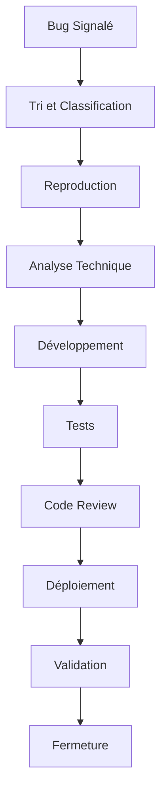

# Plan de Correction des Bogues - Benevoclic

## Vue d'ensemble

Ce document définit le processus de gestion et de correction des bogues pour l'application Benevoclic. Il couvre l'identification, la priorisation, la résolution et la prévention des problèmes techniques.

## 1. Système de Gestion des Bogues

### 1.1 Outils Utilisés

#### Plateforme de Suivi
- **GitHub Issues** : Suivi principal des bogues
- **GitHub Projects** : Tableau Kanban pour la gestion
- **Discord** : Communication en temps réel
- **Email** : Notifications automatiques

#### Intégrations
```yaml
# GitHub Actions - Bug Tracking
name: Bug Tracking
on:
  issues:
    types: [opened, closed, labeled]

jobs:
  notify:
    runs-on: ubuntu-latest
    steps:
      - name: Notify Discord
        uses: 8398a7/action-slack@v3
        with:
          status: ${{ job.status }}
          channel: '#bugs'
          webhook_url: ${{ secrets.DISCORD_WEBHOOK }}
```

### 1.2 Classification des Bogues

#### Niveaux de Sévérité
```typescript
enum BugSeverity {
  CRITICAL = 'critical',    // Application inutilisable
  HIGH = 'high',           // Fonctionnalité majeure cassée
  MEDIUM = 'medium',       // Fonctionnalité partiellement cassée
  LOW = 'low',             // Problème mineur
  COSMETIC = 'cosmetic'    // Problème visuel uniquement
}

enum BugPriority {
  IMMEDIATE = 'immediate',  // Correction immédiate requise
  HIGH = 'high',           // Correction dans les 24h
  MEDIUM = 'medium',       // Correction dans la semaine
  LOW = 'low',             // Correction dans le mois
  BACKLOG = 'backlog'      // À traiter plus tard
}
```

#### Types de Bogues
- **Bug** : Fonctionnalité qui ne fonctionne pas
- **Feature Request** : Nouvelle fonctionnalité demandée
- **Enhancement** : Amélioration d'une fonctionnalité
- **Documentation** : Problème de documentation
- **Performance** : Problème de performance
- **Security** : Vulnérabilité de sécurité

## 2. Processus de Détection

### 2.1 Sources de Détection

#### Monitoring Automatique
```typescript
// Système de détection automatique
interface BugDetection {
  // Monitoring applicatif
  applicationErrors: {
    unhandledExceptions: boolean
    apiErrors: boolean
    databaseErrors: boolean
  }
  
  // Monitoring utilisateur
  userReports: {
    errorReports: boolean
    feedbackForms: boolean
    supportTickets: boolean
  }
  
  // Monitoring performance
  performanceIssues: {
    slowQueries: boolean
    highMemoryUsage: boolean
    slowPageLoads: boolean
  }
}
```

#### Alertes Automatiques
```yaml
# Prometheus Alert Rules
groups:
  - name: bug_detection
    rules:
      - alert: HighErrorRate
        expr: rate(http_requests_total{status=~"5.."}[5m]) > 0.1
        for: 2m
        labels:
          severity: critical
          type: bug
        annotations:
          summary: "Taux d'erreur élevé détecté"
          
      - alert: SlowResponseTime
        expr: histogram_quantile(0.95, rate(http_request_duration_seconds_bucket[5m])) > 1
        for: 5m
        labels:
          severity: warning
          type: performance
        annotations:
          summary: "Temps de réponse lent détecté"
```

### 2.2 Signalement des Bogues

#### Template de Signalement
```markdown
## Description du Bogue

### Résumé
[Description courte du problème]

### Étapes pour Reproduire
1. [Étape 1]
2. [Étape 2]
3. [Étape 3]

### Comportement Attendu
[Ce qui devrait se passer]

### Comportement Observé
[Ce qui se passe réellement]

### Informations Supplémentaires
- **Navigateur** : [Chrome/Firefox/Safari/Edge]
- **Version** : [Version du navigateur]
- **OS** : [Windows/Mac/Linux]
- **URL** : [URL de la page]
- **Compte utilisateur** : [Type de compte]

### Captures d'Écran
[Si applicable]

### Logs
[Logs d'erreur si disponibles]
```

## 3. Processus de Priorisation

### 3.1 Matrice de Priorisation

#### Critères d'Évaluation
```typescript
interface BugPrioritization {
  impact: {
    users: number        // Nombre d'utilisateurs affectés
    functionality: string // Fonctionnalité critique/majeure/mineure
    business: string     // Impact sur l'activité
  }
  
  urgency: {
    frequency: string    // Fréquence d'occurrence
    workaround: boolean  // Solution de contournement disponible
    deadline: Date       // Date limite de correction
  }
  
  effort: {
    complexity: string   // Complexité de la correction
    time: number        // Temps estimé de correction
    resources: string[] // Ressources nécessaires
  }
}
```

#### Matrice de Décision
| Impact | Urgence | Effort | Priorité | Délai |
|--------|---------|--------|----------|-------|
| Critique | Immédiate | Faible | IMMEDIATE | 2h |
| Critique | Immédiate | Élevé | HIGH | 24h |
| Majeure | Élevée | Faible | HIGH | 24h |
| Majeure | Élevée | Élevé | MEDIUM | 1 semaine |
| Mineure | Faible | Faible | LOW | 1 mois |
| Mineure | Faible | Élevé | BACKLOG | Planning |

### 3.2 Workflow de Priorisation

#### Étapes de Validation
1. **Réception** : Bug signalé
2. **Tri** : Classification initiale
3. **Reproduction** : Validation du bug
4. **Analyse** : Évaluation de l'impact
5. **Priorisation** : Attribution de la priorité
6. **Assignation** : Attribution à un développeur

## 4. Processus de Résolution

### 4.1 Workflow de Correction

#### Étapes de Résolution


#### Template de Résolution
```markdown
## Résolution du Bogue

### Analyse
[Analyse technique du problème]

### Solution
[Description de la solution implémentée]

### Code Modifié
```diff
- Ancien code problématique
+ Nouveau code corrigé
```

### Tests Effectués
- [ ] Test unitaire
- [ ] Test d'intégration
- [ ] Test manuel
- [ ] Test de régression

### Impact
[Impact de la correction sur l'application]

### Validation
[Comment valider que le bug est corrigé]
```

### 4.2 Standards de Code

#### Règles de Correction
```typescript
// Standards pour les corrections de bugs
interface BugFixStandards {
  // Tests obligatoires
  testing: {
    unitTest: boolean      // Test unitaire requis
    integrationTest: boolean // Test d'intégration requis
    regressionTest: boolean  // Test de régression requis
  }
  
  // Documentation
  documentation: {
    codeComments: boolean  // Commentaires dans le code
    changelog: boolean     // Mise à jour du changelog
    documentation: boolean // Mise à jour de la documentation
  }
  
  // Code Review
  codeReview: {
    mandatory: boolean     // Code review obligatoire
    approvers: number      // Nombre d'approbateurs requis
    automatedChecks: boolean // Vérifications automatisées
  }
}
```

### 4.3 Tests de Régression

#### Stratégie de Tests
```typescript
// Tests de régression automatisés
interface RegressionTesting {
  // Tests automatiques
  automated: {
    unitTests: string[]    // Tests unitaires à exécuter
    integrationTests: string[] // Tests d'intégration
    e2eTests: string[]     // Tests end-to-end
  }
  
  // Tests manuels
  manual: {
    smokeTests: string[]   // Tests de fumée
    criticalPaths: string[] // Chemins critiques
    userScenarios: string[] // Scénarios utilisateur
  }
  
  // Environnements
  environments: {
    development: boolean   // Tests en développement
    staging: boolean       // Tests en staging
    production: boolean    // Tests en production
  }
}
```

## 5. Déploiement des Corrections

#### Déploiement Standard
```yaml
# GitHub Actions - Standard Deployment
name: Standard Deployment
on:
  push:
    branches: [main]

jobs:
  deploy:
    runs-on: ubuntu-latest
    steps:
      - uses: actions/checkout@v3
      - name: Run All Tests
        run: npm run test:all
      - name: Deploy to Staging
        run: ./deploy-staging.sh
      - name: Run E2E Tests
        run: npm run test:e2e
      - name: Deploy to Production
        run: ./deploy-production.sh
```

### 5.2 Rollback Strategy

#### Procédure de Rollback
```bash
#!/bin/bash
# rollback.sh
set -e

echo "Starting rollback procedure..."

# 1. Stop current deployment
docker-compose down

# 2. Restore previous version
docker image tag benevoclic:previous benevoclic:latest

# 3. Restart with previous version
docker-compose up -d

# 4. Verify rollback
./health-check.sh

# 5. Notify team
curl -X POST $DISCORD_WEBHOOK \
  -H "Content-Type: application/json" \
  -d '{"content": "Rollback completed for version $VERSION"}'

echo "Rollback completed successfully"
```

## 6. Validation et Fermeture

### 6.1 Critères de Validation

#### Checklist de Validation
```markdown
## Checklist de Validation

### Fonctionnelle
- [ ] Le bug est corrigé
- [ ] Aucune régression introduite
- [ ] Tous les tests passent
- [ ] Fonctionnalités connexes intactes

### Technique
- [ ] Code review approuvé
- [ ] Tests automatisés ajoutés
- [ ] Documentation mise à jour
- [ ] Changelog mis à jour

### Qualité
- [ ] Performance non dégradée
- [ ] Sécurité préservée
- [ ] Accessibilité maintenue
- [ ] Compatibilité préservée

### Production
- [ ] Déploiement réussi
- [ ] Monitoring en place
- [ ] Alertes configurées
- [ ] Utilisateurs notifiés
```

### 6.2 Communication

#### Notifications Automatiques
```typescript
// Système de notifications
interface BugNotifications {
  // Canaux de communication
  channels: {
    email: boolean        // Email
    slack: boolean        // Slack/Discord
    sms: boolean          // SMS
    inApp: boolean        // Notification in-app
  }
}
```

## 7. Prévention des Bogues

### 7.1 Pratiques de Développement

#### Standards de Code
```typescript
// Standards de développement
interface DevelopmentStandards {
  // Code Quality
  codeQuality: {
    linting: boolean      // ESLint/Prettier
    typeChecking: boolean // TypeScript strict
    codeCoverage: number  // Couverture de tests
    complexity: number    // Complexité cyclomatique max
  }
  
  // Testing
  testing: {
    unitTests: boolean    // Tests unitaires obligatoires
    integrationTests: boolean // Tests d'intégration
    e2eTests: boolean     // Tests end-to-end
    mutationTests: boolean // Tests de mutation
  }
  
  // Security
  security: {
    staticAnalysis: boolean // Analyse statique
    dependencyScanning: boolean // Scan des dépendances
    penetrationTesting: boolean // Tests de pénétration
    codeReview: boolean    // Code review obligatoire
  }
}
```

### 7.2 Monitoring Préventif

#### Métriques de Surveillance
```yaml
# Métriques de surveillance préventive
monitoring:
  # Métriques applicatives
  application:
    - error_rate: "Taux d'erreur < 0.1%"
    - response_time: "Temps de réponse < 200ms"
    - throughput: "Débit > 1000 req/s"
    - memory_usage: "Utilisation mémoire < 80%"
  
  # Métriques métier
  business:
    - user_registration: "Inscriptions > 0"
    - event_creation: "Création d'événements > 0"
    - user_engagement: "Engagement utilisateur stable"
  
  # Métriques techniques
  technical:
    - database_connections: "Connexions DB < 80%"
    - disk_usage: "Espace disque < 85%"
    - cpu_usage: "CPU < 70%"
    - network_latency: "Latence réseau < 100ms"
```

### 7.3 Formation et Documentation

#### Programme de Formation
```markdown
## Programme de Formation

### Développeurs
- **Bonnes pratiques** : Standards de code
- **Testing** : Stratégies de test
- **Debugging** : Techniques de débogage
- **Code Review** : Processus de review

### QA
- **Test Planning** : Planification des tests
- **Bug Reporting** : Signalement efficace
- **Regression Testing** : Tests de régression
- **Automation** : Automatisation des tests

### DevOps
- **Monitoring** : Surveillance des systèmes
- **Deployment** : Stratégies de déploiement
- **Incident Response** : Gestion des incidents
- **Rollback** : Procédures de rollback
```

## 8. Métriques et Reporting

### 8.1 KPIs de Gestion des Bogues

#### Métriques Clés
```typescript
// KPIs de gestion des bogues
interface BugMetrics {
  // Volume
  volume: {
    totalBugs: number     // Total des bugs
    openBugs: number      // Bugs ouverts
    closedBugs: number    // Bugs fermés
    newBugs: number       // Nouveaux bugs
  }
  
  // Temps
  time: {
    avgResolutionTime: number // Temps moyen de résolution
    avgResponseTime: number   // Temps moyen de réponse
    mttr: number             // Mean Time To Resolution
    mtta: number             // Mean Time To Acknowledge
  }
  
  // Qualité
  quality: {
    bugReopenRate: number    // Taux de réouverture
    customerSatisfaction: number // Satisfaction client
    firstTimeFixRate: number // Taux de correction du premier coup
  }
}
```

### 8.2 Rapports Automatiques

#### Rapports Hebdomadaires
```typescript
// Template de rapport hebdomadaire
interface WeeklyReport {
  period: {
    start: Date
    end: Date
  }
  
  summary: {
    newBugs: number
    resolvedBugs: number
    criticalBugs: number
    avgResolutionTime: number
  }
  
  trends: {
    bugVolume: 'increasing' | 'stable' | 'decreasing'
    resolutionTime: 'improving' | 'stable' | 'worsening'
    customerSatisfaction: 'improving' | 'stable' | 'worsening'
  }
  
  topIssues: Bug[]
  recommendations: string[]
}
```

## 9. Gestion des Incidents Critiques

### 9.1 Procédure d'Urgence

#### Escalade
```typescript
// Procédure d'escalade
interface EscalationProcedure {
  level1: {
    duration: '15min'      // Temps avant escalade
    contacts: string[]     // Contacts niveau 1
    actions: string[]      // Actions à effectuer
  }
  
  level2: {
    duration: '30min'      // Temps avant escalade
    contacts: string[]     // Contacts niveau 2
    actions: string[]      // Actions à effectuer
  }
  
  level3: {
    duration: '1h'         // Temps avant escalade
    contacts: string[]     // Contacts niveau 3
    actions: string[]      // Actions à effectuer
  }
}
```

### 9.2 Communication de Crise

#### Template de Communication
```markdown
## Communication d'Incident

### Résumé
[Description courte de l'incident]

### Impact
- **Utilisateurs affectés** : [Nombre]
- **Fonctionnalités impactées** : [Liste]
- **Durée estimée** : [Temps]

### Actions en Cours
1. [Action 1]
2. [Action 2]
3. [Action 3]

### Prochaines Étapes
- [ ] [Étape 1]
- [ ] [Étape 2]
- [ ] [Étape 3]

### Contact
[Contact pour plus d'informations]
```

## Conclusion

Ce plan de correction des bogues garantit une gestion efficace et systématique des problèmes techniques, avec un focus sur :

- **Réactivité** : Détection et résolution rapides
- **Qualité** : Standards élevés de correction
- **Prévention** : Réduction des futurs bogues
- **Communication** : Transparence avec les utilisateurs
- **Amélioration continue** : Apprentissage des incidents