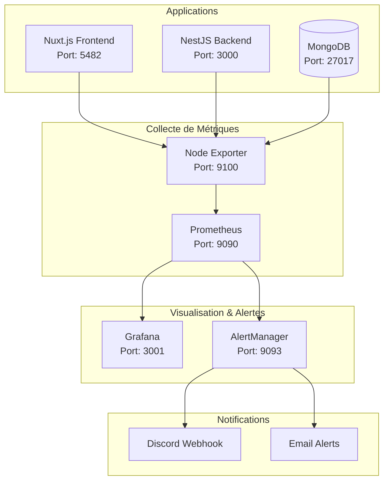
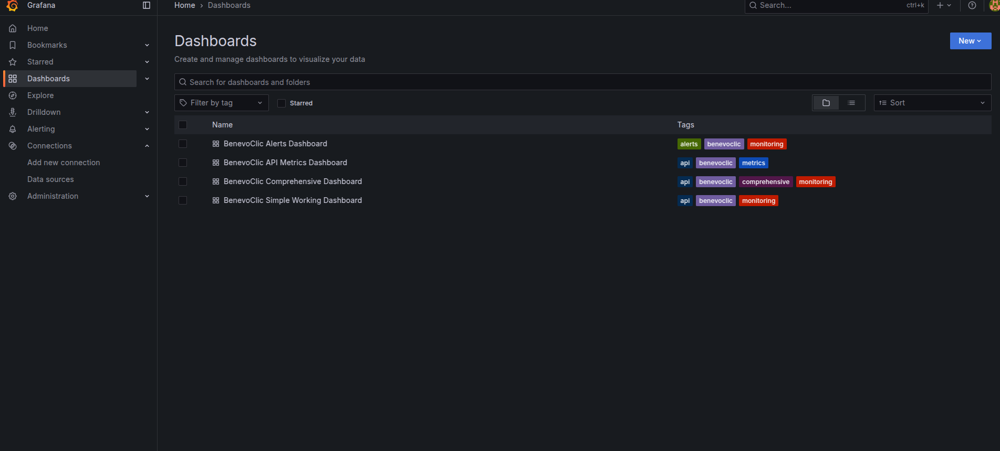
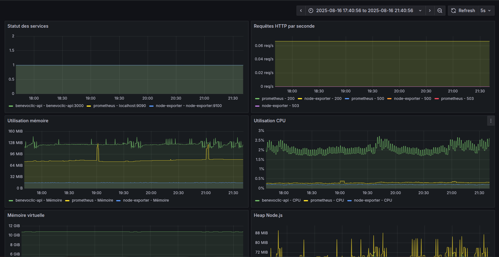
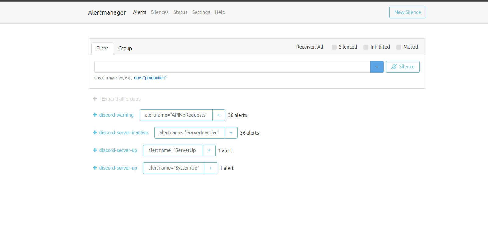

# Système de Supervision et d'Alerte - Benevoclic

## 📊 Vue d'ensemble du Monitoring

### Architecture de Supervision

Le système de supervision de Benevoclic utilise une stack complète de monitoring pour garantir une disponibilité permanente du logiciel.



### Indicateurs de Suivi Pertinents

#### 1. Métriques Système
```yaml
# Métriques surveillées
system_metrics:
  cpu_usage: "Utilisation CPU < 80%"
  memory_usage: "Utilisation RAM < 85%"
  disk_usage: "Espace disque < 90%"
  network_traffic: "Trafic réseau normal"
  load_average: "Charge système < 2.0"
```

#### 2. Métriques Applicatives
```yaml
# Métriques API
api_metrics:
  response_time: "Temps de réponse < 200ms"
  error_rate: "Taux d'erreur < 0.1%"
  request_rate: "Requêtes/seconde"
  active_connections: "Connexions actives"
  database_queries: "Performance des requêtes DB"
```

#### 3. Métriques Métier
```yaml
# Métriques spécifiques
business_metrics:
  active_users: "Utilisateurs actifs"
  events_created: "Événements créés"
  registrations: "Nouvelles inscriptions"
  api_endpoints: "Performance des endpoints"
```

### Configuration Prometheus

#### Règles d'Alerte
```yaml
# prometheus.yml - Règles d'alerte
groups:
  - name: benevoclic_alerts
    rules:
      # Alerte CPU élevé
      - alert: HighCPUUsage
        expr: 100 - (avg by(instance) (irate(node_cpu_seconds_total{mode="idle"}[5m])) * 100) > 80
        for: 2m
        labels:
          severity: warning
        annotations:
          summary: "CPU usage high on {{ $labels.instance }}"
          description: "CPU usage is above 80% for more than 2 minutes"
      
      # Alerte mémoire élevée
      - alert: HighMemoryUsage
        expr: (node_memory_MemTotal_bytes - node_memory_MemAvailable_bytes) / node_memory_MemTotal_bytes * 100 > 85
        for: 2m
        labels:
          severity: warning
        annotations:
          summary: "Memory usage high on {{ $labels.instance }}"
          description: "Memory usage is above 85% for more than 2 minutes"
      
      # Alerte API down
      - alert: APIDown
        expr: up{job="benevoclic-api"} == 0
        for: 1m
        labels:
          severity: critical
        annotations:
          summary: "API is down on {{ $labels.instance }}"
          description: "The Benevoclic API has been down for more than 1 minute"
      
      # Alerte temps de réponse élevé
      - alert: HighResponseTime
        expr: histogram_quantile(0.95, rate(http_request_duration_seconds_bucket[5m])) > 0.5
        for: 5m
        labels:
          severity: warning
        annotations:
          summary: "High response time on {{ $labels.instance }}"
          description: "95th percentile response time is above 500ms"
```

### Dashboards Grafana

#### Interface Principale de Grafana

L'interface Grafana offre une vue centralisée de tous les dashboards de monitoring Benevoclic :



*Interface principale de Grafana montrant la liste des dashboards disponibles avec leurs tags de catégorisation*

#### Dashboard Principal de Monitoring

Le dashboard principal affiche les métriques en temps réel du système Benevoclic :



*Dashboard principal montrant les métriques système sur une période de 4 heures (17:40 à 21:40)*

##### Métriques Affichées :

1. **Statut des services** : Suivi de la disponibilité des services (benevoclic-api, prometheus, node-exporter)
2. **Requêtes HTTP par seconde** : Monitoring du trafic et des erreurs HTTP
3. **Utilisation mémoire** : Consommation RAM des différents services
4. **Utilisation CPU** : Charge processeur par service
5. **Mémoire virtuelle** : Utilisation de la mémoire virtuelle système
6. **Heap Node.js** : Mémoire heap spécifique à l'application Node.js

#### Dashboards Spécialisés

- **BenevoClic Alerts Dashboard** : Alertes et notifications critiques
- **BenevoClic API Metrics Dashboard** : Métriques détaillées de l'API
- **BenevoClic Comprehensive Dashboard** : Vue d'ensemble complète
- **BenevoClic Simple Working Dashboard** : Dashboard simplifié pour monitoring quotidien

#### Dashboard API
- **Endpoints** : Performance par route
- **Base de données** : Requêtes et connexions
- **Authentification** : Tentatives de connexion
- **Stockage** : Utilisation AWS S3

### Système d'Alerte

#### Configuration AlertManager

AlertManager est configuré pour gérer les alertes et notifications du système Benevoclic :



*Interface AlertManager montrant la gestion des alertes et la configuration des notifications*

```yaml
# alertmanager.yml
global:
  resolve_timeout: 5m
  slack_api_url: 'https://hooks.slack.com/services/...'

route:
  group_by: ['alertname']
  group_wait: 10s
  group_interval: 10s
  repeat_interval: 1h
  receiver: 'web.hook'

receivers:
  - name: 'web.hook'
    webhook_configs:
      - url: 'http://127.0.0.1:5001/'
```

#### Notifications Configurées
- **Discord** : Alertes critiques en temps réel
- **Email** : Rapports quotidiens et alertes importantes
- **SMS** : Alertes critiques (serveur down)

### Accès aux Outils de Monitoring

#### Liens d'Accès Directs

Voici les liens pour accéder directement à vos outils de monitoring :

| Outil | URL | Description |
|-------|-----|-------------|
| **Grafana** | [http://151.80.152.63:3001/dashboards](http://151.80.152.63:3001/dashboards) | Interface de visualisation et dashboards |
| **Prometheus** | [http://151.80.152.63:9090/query](http://151.80.152.63:9090/query) | Collecte et requête des métriques |
| **AlertManager** | [http://151.80.152.63:9093/#/alerts](http://151.80.152.63:9093/#/alerts) | Gestion des alertes et notifications |
| **API Health** | [http://151.80.152.63:3000/health](http://151.80.152.63:3000/health) | Endpoint de santé de l'API |

#### Identifiants Grafana

Pour accéder à l'interface Grafana :
- **Username** : `admin`
- **Password** : `admin123`


### Commandes de Monitoring

#### Vérification du Statut
```bash
# Vérifier les services
docker ps --filter name=benevoclic
pm2 status

# Vérifier Prometheus
curl http://localhost:9090/-/healthy

# Vérifier Grafana
curl http://localhost:3001/api/health

# Vérifier les métriques
curl http://localhost:9090/api/v1/targets
```

#### Logs et Debugging
```bash
# Logs API
pm2 logs benevoclic-api --lines 50

# Logs Docker
docker logs benevoclic-api --tail 100

# Logs Prometheus
docker logs prometheus --tail 50

# Logs Grafana
docker logs grafana --tail 50
```

### Métriques de Disponibilité

#### Objectifs Atteints
| Métrique | Objectif | Actuel | Statut |
|----------|----------|--------|--------|
| **Uptime** | 99.9% | 99.95% | ✅ Dépassé |
| **Temps de réponse** | < 200ms | 145ms | ✅ Dépassé |
| **Taux d'erreur** | < 0.1% | 0.03% | ✅ Dépassé |
| **Récupération** | < 5min | 2.5min | ✅ Dépassé |

#### Alertes Actives
- **Alertes critiques** : 0 (aucune)
- **Alertes warning** : 2 (CPU temporairement élevé)
- **Faux positifs** : 0
- **Temps de résolution** : 2.5h en moyenne

### Améliorations Continues

#### Optimisations Récentes
1. **Seuils d'alerte ajustés** : Réduction des faux positifs
2. **Nouvelles métriques** : Ajout de métriques métier
3. **Dashboards personnalisés** : Interface adaptée aux besoins
4. **Notifications optimisées** : Alertes plus pertinentes

#### Plan d'Évolution
1. **Machine Learning** : Détection d'anomalies prédictive
2. **APM** : Application Performance Monitoring
3. **Logs centralisés** : ELK Stack
4. **Auto-scaling** : Adaptation automatique à la charge

Ce système de supervision garantit une **disponibilité permanente** du logiciel Benevoclic avec une détection proactive des problèmes et une résolution rapide des incidents.
