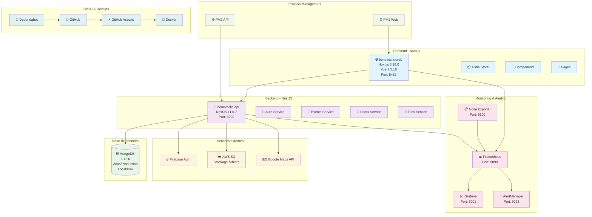
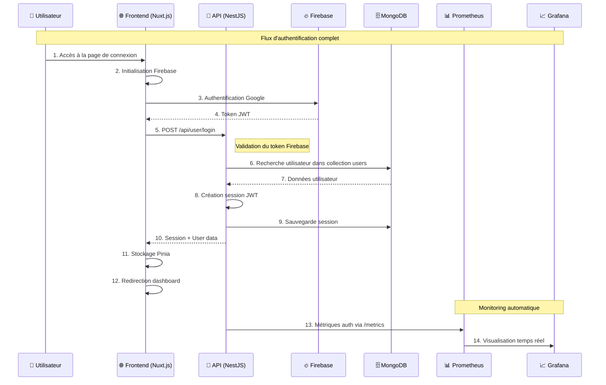
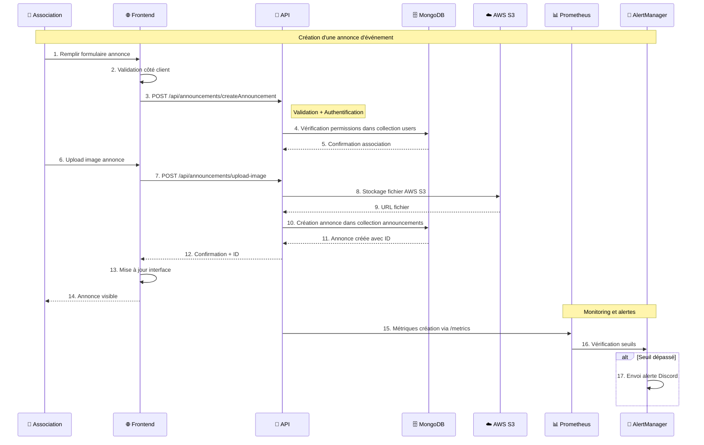
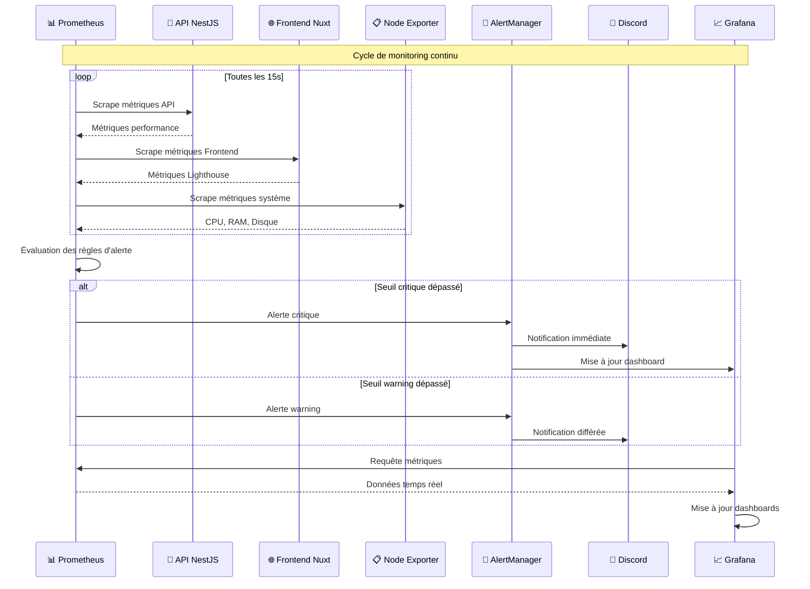
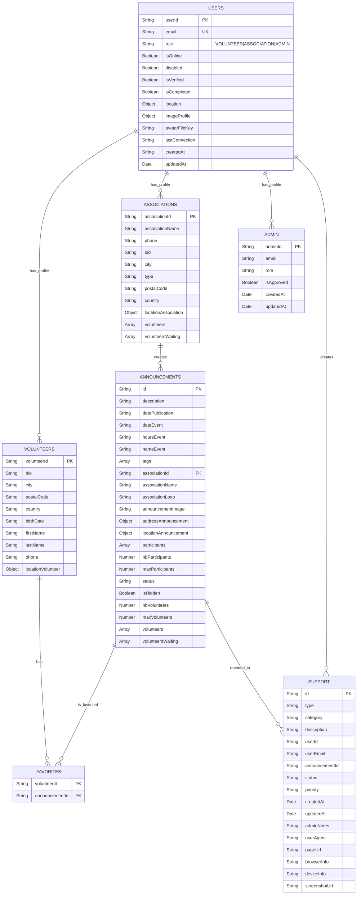

# Architecture et Diagrammes Benevoclic

## 🏗️ Vue d'ensemble de l'architecture

L'architecture Benevoclic repose sur une **stack moderne** avec séparation claire des responsabilités, monitoring complet et haute disponibilité.

## 📊 Diagramme d'architecture globale



## 🔄 Diagramme de séquence - Flux d'authentification



## 📈 Diagramme de séquence - Création d'annonce



## 🔍 Diagramme de séquence - Monitoring et alertes



## 🏢 Architecture détaillée par couches

### Couche Présentation (Frontend)
```
┌─────────────────────────────────────────────────────────────┐
│                    FRONTEND - NUXT.JS                       │
├─────────────────────────────────────────────────────────────┤
│  🌐 Pages (Vue Router)                                      │
│  ├── / (Accueil)                                            │
│  ├── /auth/login (Connexion)                                │
│  ├── /association/* (Espace association)                    │
│  └── /volunteer/* (Espace bénévole)                         │
│                                                             │
│  🧩 Components (Vue 3)                                      │
│  ├── Header, Footer, Navigation                             │
│  ├── Forms (Inscription, Événements)                        │
│  ├── Maps (Maplibre GL)                                     │
│  └── Modals (Détails, Confirmation)                         │
│                                                             │
│  📦 Stores (Pinia)                                          │
│  ├── User Store (Authentification)                          │
│  ├── Events Store (Gestion événements)                      │
│  └── UI Store (État interface)                              │
│                                                             │
│  🔧 Composables (Logique métier)                            │
│  ├── useAuth (Authentification)                             │
│  ├── useEvents (Gestion événements)                         │
│  └── useGeolocation (Géolocalisation)                       │
└─────────────────────────────────────────────────────────────┘
```

### Couche Application (Backend)
```
┌─────────────────────────────────────────────────────────────┐
│                    BACKEND - NESTJS                         │
├─────────────────────────────────────────────────────────────┤
│  🚀 Controllers (Endpoints API)                             │
│  ├── AuthController (/api/auth/*)                           │
│  ├── UsersController (/api/users/*)                         │
│  ├── EventsController (/api/events/*)                       │
│  ├── AssociationsController (/api/associations/*)           │
│  └── FilesController (/api/files/*)                         │
│                                                             │
│  🔧 Services (Logique métier)                               │
│  ├── AuthService (Firebase + JWT)                           │
│  ├── UsersService (CRUD utilisateurs)                       │
│  ├── EventsService (Gestion événements)                     │
│  ├── FileService (AWS S3)                                   │
│  └── NotificationService (Emails + Push)                    │
│                                                             │
│  🗄️ Repositories (Accès données)                            │
│  ├── UserRepository (MongoDB)                               │
│  ├── EventRepository (MongoDB)                              │
│  ├── AssociationRepository (MongoDB)                        │
│  └── ParticipationRepository (MongoDB)                      │
│                                                             │
│  🛡️ Guards & Interceptors                                   │
│  ├── AuthGuard (Protection routes)                          │
│  ├── RoleGuard (Permissions)                                │
│  └── LoggingInterceptor (Monitoring)                        │
└─────────────────────────────────────────────────────────────┘
```

### Couche Infrastructure (Monitoring)
```
┌─────────────────────────────────────────────────────────────┐
│                  MONITORING STACK                           │
├─────────────────────────────────────────────────────────────┤
│  📊 Prometheus (Collecte métriques)                         │
│  ├── Métriques API (Temps réponse, erreurs)                 │
│  ├── Métriques Frontend (Lighthouse scores)                 │
│  ├── Métriques Système (CPU, RAM, Disque)                   │
│  └── Métriques Business (Utilisateurs, événements)          │
│                                                             │
│  📈 Grafana (Visualisation)                                 │
│  ├── Dashboard Principal (Vue d'ensemble)                   │
│  ├── Dashboard Technique (Détails)                          │
│  ├── Dashboard Business (Métriques utilisateurs)            │
│  └── Dashboard Sécurité (Tentatives d'accès)                │
│                                                             │
│  🚨 AlertManager (Gestion alertes)                          │
│  ├── Règles d'alerte (Seuils critiques/warning)             │
│  ├── Notifications Discord (Temps réel)                     │
│  ├── Notifications Email (Rapports)                         │
│  └── Escalade automatique (Critique)                        │
│                                                             │
│  ⚙️ PM2 (Process Manager)                                   │
│  ├── Monitoring processus (API + Web)                       │
│  ├── Logs structurés (JSON)                                 │
│  ├── Restart automatique (Crash)                            │
│  └── Métriques performance (CPU, RAM)                       │
└─────────────────────────────────────────────────────────────┘
```

## 🔄 Flux de données et communication

### Communication inter-services
```
┌─────────────┐    HTTP/REST    ┌─────────────┐
│   Frontend  │◄──────────────►│    API      │
│  (Nuxt.js)  │                 │  (NestJS)   │
└─────────────┘                 └─────────────┘
       │                              │
       │ WebSocket                    │ MongoDB
       │ (Real-time)                  │ Driver
       ▼                              ▼
┌─────────────┐                 ┌─────────────┐
│   Socket.IO │                 │   MongoDB   │
│  (Events)   │                 │  (Atlas)    │
└─────────────┘                 └─────────────┘
```

### Monitoring et observabilité
```
┌─────────────┐    Métriques    ┌─────────────┐
│   Prometheus│◄──────────────►│    API      │
│             │                 │  (NestJS)   │
└─────────────┘                 └─────────────┘
       │                              │
       │ Alerting                     │ Logs
       ▼                              ▼
┌─────────────┐                 ┌─────────────┐
│AlertManager │                 │   PM2       │
│             │                 │  (Logs)     │
└─────────────┘                 └─────────────┘
       │                              │
       │ Notifications                │ Monitoring
       ▼                              ▼
┌─────────────┐                 ┌─────────────┐
│   Discord   │                 │   Grafana   │
│  (Webhook)  │                 │ (Dashboard) │
└─────────────┘                 └─────────────┘
```

## 🎯 Points clés de l'architecture

### ✅ **Avantages de cette architecture**

1. **Séparation des responsabilités** : Frontend, Backend, Base de données, Monitoring
2. **Scalabilité** : Chaque service peut être mis à l'échelle indépendamment
3. **Observabilité** : Monitoring complet avec Prometheus + Grafana
4. **Haute disponibilité** : PM2 + AlertManager + Redémarrage automatique
5. **Sécurité** : Firebase Auth + JWT + Guards NestJS
6. **Performance** : Optimisations MongoDB

### 🔧 **Technologies utilisées**

- **Frontend** : Nuxt.js 3, Vue 3, Pinia, Tailwind CSS
- **Backend** : NestJS 11, TypeScript, MongoDB
- **Monitoring** : Prometheus, Grafana, AlertManager, PM2
- **Infrastructure** : Docker, AWS S3, Firebase
- **CI/CD** : GitHub Actions, Dependabot

### 📊 **Métriques de performance**

- **Temps de réponse API** : < 200ms (P95)
- **Disponibilité** : 99.9% (SLA)
- **Lighthouse Score** : > 80 (Performance)
- **Couverture de tests** : > 80%
- **Temps de résolution incidents** : < 5 minutes

## 🗄️ Schéma de base de données MongoDB

### Vue d'ensemble des collections



### Détail des collections

#### Collection `users`
```javascript
{
  userId: String,                   // ID unique utilisateur (Firebase UID)
  email: String,                    // Email unique
  role: String,                     // "VOLUNTEER" | "ASSOCIATION" | "ADMIN"
  isOnline: Boolean,                // Statut en ligne
  disabled: Boolean,                // Compte désactivé
  isVerified: Boolean,              // Email vérifié
  isCompleted?: Boolean,            // Profil complété
  location?: {
    address: String,                // Adresse complète
    city: String,                   // Ville
    postalCode: String,             // Code postal
    country: String                 // Pays
  },
  imageProfile?: {
    data: String,                   // Données image (base64)
    contentType: String,            // Type MIME
    uploadedAt: Date                // Date upload
  },
  avatarFileKey?: String,           // Clé fichier avatar
  lastConnection: String,           // Dernière connexion
  createdAt: String,                // Date création
  updatedAt: Date                   // Date modification
}
```

#### Collection `volunteers`
```javascript
{
  volunteerId: String,              // ID unique bénévole (Firebase UID)
  bio?: String,                     // Biographie
  city?: String,                    // Ville
  postalCode?: String,              // Code postal
  country?: String,                 // Pays
  birthDate?: String,               // Date de naissance
  firstName: String,                // Prénom
  lastName: String,                 // Nom
  phone?: String,                   // Téléphone
  locationVolunteer?: {
    type: "Point",                  // Type GeoJSON
    coordinates: [Number, Number]   // [longitude, latitude]
  }
}
```

#### Collection `associations`
```javascript
{
  associationId: String,            // ID unique association (Firebase UID)
  associationName: String,          // Nom de l'association
  phone: String,                    // Téléphone
  bio: String,                      // Description
  city: String,                     // Ville
  type: String,                     // Type d'association
  postalCode: String,               // Code postal
  country: String,                  // Pays
  locationAssociation?: {
    type: "Point",                  // Type GeoJSON
    coordinates: [Number, Number]   // [longitude, latitude]
  },
  volunteers?: [{
    volunteerId: String,            // ID bénévole
    volunteerName: String,          // Nom bénévole
    dateAdded?: String              // Date ajout
  }],
  volunteersWaiting?: [{
    volunteerId: String,            // ID bénévole en attente
    volunteerName: String,          // Nom bénévole
    dateAdded?: String              // Date demande
  }]
}
```

#### Collection `announcements`
```javascript
{
  id?: String,                      // ID unique annonce
  description: String,              // Description de l'événement
  datePublication: String,          // Date de publication
  dateEvent: String,                // Date de l'événement
  hoursEvent: String,               // Heure de l'événement
  nameEvent: String,                // Nom de l'événement
  tags?: [String],                  // Tags/catégories
  associationId: String,            // ID association créatrice
  associationName: String,          // Nom association
  associationLogo?: String,         // Logo association
  announcementImage?: String,       // Image événement
  addressAnnouncement?: {
    address: String,                // Adresse complète
    city: String,                   // Ville
    postalCode: String,             // Code postal
    country: String                 // Pays
  },
  locationAnnouncement?: {
    type: "Point",                  // Type GeoJSON
    coordinates: [Number, Number]   // [longitude, latitude]
  },
  participants?: [{
    id: String,                     // ID participant
    name: String,                   // Nom participant
    isPresent?: Boolean,            // Présent à l'événement
    dateAdded?: String              // Date inscription
  }],
  nbParticipants?: Number,          // Nombre participants actuels
  maxParticipants: Number,          // Nombre max participants
  status: String,                   // Statut annonce
  isHidden?: Boolean,               // Annonce masquée
  nbVolunteers?: Number,            // Nombre bénévoles actuels
  maxVolunteers: Number,            // Nombre max bénévoles
  volunteers?: [{
    id: String,                     // ID bénévole
    name: String,                   // Nom bénévole
    isPresent?: Boolean,            // Présent à l'événement
    dateAdded?: String              // Date inscription
  }],
  volunteersWaiting?: [{
    id: String,                     // ID bénévole en attente
    name: String,                   // Nom bénévole
    isPresent?: Boolean,            // Présent à l'événement
    dateAdded?: String              // Date demande
  }]
}
```

#### Collection `favorites`
```javascript
{
  volunteerId: String,              // ID bénévole
  announcementId: String            // ID annonce
}
```

#### Collection `support`
```javascript
{
  id?: String,                      // ID unique rapport
  type: String,                     // Type de rapport
  category: String,                 // Catégorie spécifique
  description: String,              // Description du problème
  userId?: String,                  // ID utilisateur rapporteur
  userEmail?: String,               // Email utilisateur
  announcementId?: String,          // ID annonce concernée
  status: String,                   // Statut du rapport
  priority: String,                 // Priorité
  createdAt: Date,                  // Date création
  updatedAt: Date,                  // Date modification
  adminNotes?: String,              // Notes administrateur
  userAgent?: String,               // User agent navigateur
  pageUrl?: String,                 // URL page concernée
  browserInfo?: String,             // Informations navigateur
  deviceInfo?: String,              // Informations appareil
  screenshotUrl?: String            // URL capture d'écran
}
```

#### Collection `admin`
```javascript
{
  adminId: String,                  // ID unique administrateur
  email: String,                    // Email admin
  role: String,                     // Rôle administrateur
  isApproved: Boolean,              // Statut approbation
  createdAt: Date,                  // Date création
  updatedAt: Date                   // Date modification
}
```

### Agrégations MongoDB courantes

#### Statistiques des annonces par association
```javascript
db.announcements.aggregate([
  {
    $group: {
      _id: "$associationId",
      totalAnnouncements: { $sum: 1 },
      activeAnnouncements: {
        $sum: { $cond: [{ $eq: ["$status", "ACTIVE"] }, 1, 0] }
      },
      avgParticipants: { $avg: "$maxParticipants" },
      avgVolunteers: { $avg: "$maxVolunteers" }
    }
  },
  {
    $lookup: {
      from: "associations",
      localField: "_id",
      foreignField: "associationId",
      as: "association"
    }
  }
])
```

#### Annonces proches d'un utilisateur
```javascript
db.announcements.find({
  locationAnnouncement: {
    $near: {
      $geometry: {
        type: "Point",
        coordinates: [longitude, latitude]
      },
      $maxDistance: 10000 // 10km
    }
  },
  status: "ACTIVE",
  dateEvent: { $gte: new Date().toISOString() }
})
```

#### Participants d'une annonce avec détails
```javascript
db.announcements.aggregate([
  {
    $match: { id: "announcement_id" }
  },
  {
    $unwind: "$participants"
  },
  {
    $lookup: {
      from: "volunteers",
      localField: "participants.id",
      foreignField: "volunteerId",
      as: "volunteer"
    }
  },
  {
    $unwind: "$volunteer"
  },
  {
    $group: {
      _id: "$participants.isPresent",
      count: { $sum: 1 },
      volunteers: { $push: "$volunteer" }
    }
  }
])
```

#### Favoris d'un bénévole avec détails des annonces
```javascript
db.favorites.aggregate([
  {
    $match: { volunteerId: "volunteer_id" }
  },
  {
    $lookup: {
      from: "announcements",
      localField: "announcementId",
      foreignField: "id",
      as: "announcement"
    }
  },
  {
    $unwind: "$announcement"
  },
  {
    $match: { "announcement.status": "ACTIVE" }
  },
  {
    $project: {
      _id: 0,
      announcementId: 1,
      nameEvent: "$announcement.nameEvent",
      dateEvent: "$announcement.dateEvent",
      associationName: "$announcement.associationName"
    }
  }
])
```

#### Rapports de support par catégorie
```javascript
db.support.aggregate([
  {
    $group: {
      _id: "$category",
      count: { $sum: 1 },
      avgPriority: { $avg: { $toInt: "$priority" } }
    }
  },
  {
    $sort: { count: -1 }
  }
])
```

Cette architecture garantit une **plateforme robuste, scalable et maintenable** pour l'écosystème Benevoclic ! 🚀
